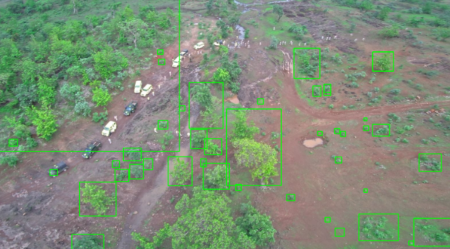

# Tree Plantation Health Detection Model

## Code Documentation

### 1. Introduction

This document provides detailed documentation for the implementation of a Tree Plantation Health Detection Model intended for deployment on Jetson Nano-based drones and UAVs.

The purpose of this project is to detect and analyze the health condition of trees using a YOLO-based object detection model, annotated images, and custom logical attributes. This guide breaks down the code into sections and provides usage instructions, explanations, and prerequisites required to run the implementation.

The detection model has been optimized for Jetson Nano, which is commonly used in drones with limited RAM and memory. A highly efficient YOLOv8 (nano) model and a quantized version of TinyLlama have been used to ensure smooth inference without heavy computational load. The detections will either be a single tree or clustered trees, whose information you may check in the inference prompts generated later.

---

### 2. Prerequisites

Before running the code, ensure you have the following:

- Python 3.8 or higher  
- Required Python libraries (install using `pip`):
  - `ultralytics`
  - `opencv-python`
  - `matplotlib`
  - `os`
  - `json`
- A trained YOLOv8 model (e.g., `best.pt`) placed in the correct directory  (by default, in the `/models` directory)
- Input image directory with test images  (by default, in the `/test_images` directory)
- Output directory for saving annotated images and JSON files
- Quantized TinyLlama Model GGUF (You may download from the following link: [Click Here](https://huggingface.co/TheBloke/TinyLlama-1.1B-Chat-v1.0-GGUF))

## Install LLaMA Model and Run llama.cpp

```bash
git clone https://github.com/ggerganov/llama.cpp && cd llama.cpp
make
./main -m models/your-model.gguf -p "Hello!"
```
Replace `your-model.gguf` with your actual model file (e.g., `tinyllama-1b-chat.gguf`) placed inside the `models/` folder.

To install the above prerequisites
```bash
pip install -r requirements.txt
```

You must change the input and output directory paths according to your requirements in the `paths.py` file.

You may change the tree attribute tunable parameters according to your requirements in the `config.py` file.

---

### 3. Implementation Overview

This implementation offers a practical solution for automated tree health monitoring in afforestation zones using YOLO-based object detection. It's designed for deployment on drones to enable large-scale, real-time environmental analysis.

<details>
<summary>Key Steps</summary>

1. **Import Required Libraries**  
   Load necessary Python libraries including Ultralytics YOLO, OpenCV, JSON, and Matplotlib for visualization.

2. **Load YOLO Model**  
   Use a pre-trained YOLOv8 model (`best.pt`) to detect objects in plantation images.

3. **Read Test Images**  
   Load all test images from a specified directory into memory for processing.

4. **Run Detection**  
   Pass each image through the YOLO model to obtain bounding boxes and class predictions.

5. **Extract and Visualize Results**  
   Use OpenCV to draw bounding boxes and extract metadata from predictions.

6. **Save Metadata in JSON Format**  
   Store model predictions, including standard COCO-style data and custom attributes (e.g., `HealthStatus`, `HasLeaves`, `TreeHeightCategory`, etc.), in structured JSON files.

7. **Save Annotated Images**  
   Save output images with drawn bounding boxes for verification and record-keeping.

8. **Use Metadata for Inference**

   Uses a pre-defined prompt using the metadata to store inference about the health of plantation using TinyLLaMA model, and stores the inference in text files for each image.

</details>

---

### 4. Use Case and Benefits

This model provides a scalable framework for integrating computer vision into smart forestry and environmental monitoring. When mounted on drones, it enables:

- Tracking the progress of afforestation efforts  
- Identifying unhealthy or isolated trees  
- Planning data-driven forestry interventions  
- Reducing manual fieldwork  
- Accelerating decision-making  
- Ensuring transparent and accountable forest governance

---

### 5. Final Directory Structure

The final directory structure after running the above `run_inference.py` will look like:

```
tree_plantation/                  <- BASE_DIR
│
├── models/                        <- Store models here
│   ├── best.pt                    <- YOLOv8n trained model
│   └── your-model-name.gguf       <- TinyLlama quantized GGUF model
│
├── test_images/                   <- Input images for inference
│   ├── image1.jpg
│   ├── image2.png
│   └── ...
│
├── test_results/                  <- YOLO annotated images (output)
│   ├── image1.jpg
│   ├── image2.png
│   └── ...
│
├── test_inference/                <- JSON outputs and prompts
│   ├── image1.json
│   ├── image2.json
│   └── ...
│   └── inference_prompts/         <- Prompts generated from JSON
│       ├── image1_inference.txt
│       └── image2_inference.txt
│
└── test_inference_result_outputs/ <- LLM outputs
    ├── image1_llm_output.txt
    └── image2_llm_output.txt
```

### 6. Sample YOLO Detection Results

You may see the sample results of detections by YOLO below:

1. The following is the YOLO detection of a random image of a tree plantation taken from the Internet.

<div>
  
  
</div>


2. The following is the YOLO detection of a real-time image captured of a forest in Madhya Pradesh, India using a drone.

<div>
  
  
</div>
